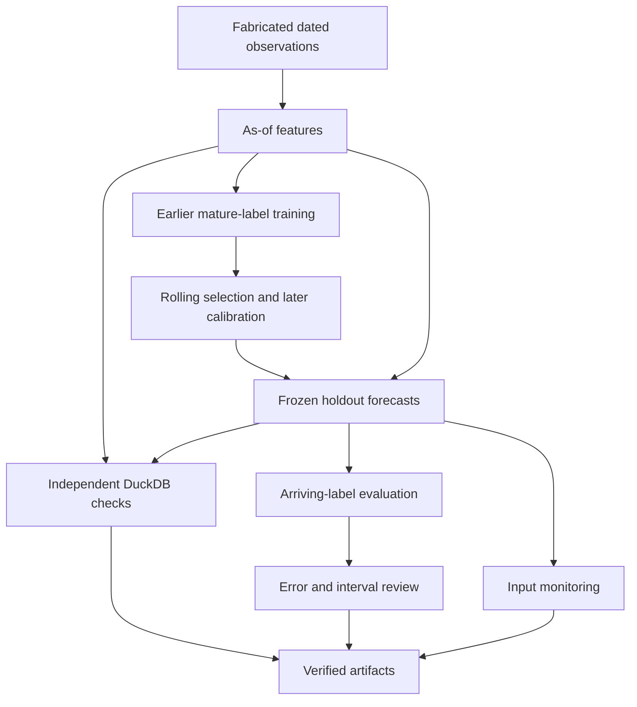

# The Predictive Production State — Research Engineering Demonstration

A public engineering demonstration associated with **The Predictive Production State: Total Production Intelligence, Fiscal Anticipation, and Adaptive Public Resource Allocation**.

This repository demonstrates forecasting-oriented data engineering, temporal information controls, analytical warehousing, reproducible evaluation, failure-safe execution, automated testing, CI, Docker, and reporting using **fully synthetic data**.

> **Scientific boundary:** this repository does not contain the protected research dataset, protected forecast pairs, unpublished empirical results, historical production-engine source code, reserve data, manuscript text, or the private scientific repository history. It is an engineering demonstration only.

## Engineering capabilities demonstrated

- Python forecasting/evaluation pipeline
- strict as-of / temporal-information guards
- synthetic multi-origin forecast data
- baseline and adaptive forecast interfaces
- fitted ridge and random-forest regressors with persistence/seasonal baselines
- expanding-window model selection using only mature training labels
- separate later calibration and a frozen multi-horizon holdout
- input drift, delayed-label error and interval-coverage monitoring
- MAE, RMSE and pinball-loss evaluation
- DuckDB staging/core/mart architecture
- executable relational quality checks
- deterministic run receipts and SHA-256 integrity
- interruption / resume demonstration
- automated JSON and Markdown reporting
- static HTML dashboard generation
- unit, integration and failure-mode tests
- GitHub Actions CI
- Dockerized execution

## ML forecasting upgrade

The original release-vintage demo uses two hand-coded forecast formulas. The
new `forecast_ml/` workflow fits actual scikit-learn estimators on a separate,
fully fabricated daily panel. It forecasts a fabricated production index at
one- and seven-day horizons. It is not a real crop or fiscal forecast.

Features use past target/weather observations with explicit arrival timestamps.
Training excludes labels that have not arrived by each fit origin. Three rolling
validation windows choose a system per horizon by MAE. Preprocessing is fitted
only on training rows. A later calibration period sets empirical error bands;
the selected system and bands then stay frozen throughout the final holdout.

Input monitoring can run before new target labels arrive. Performance monitoring
assesses earlier predictions when their labels arrive, and reports error changes
and interval undercoverage. Missing or unavailable feature histories block
forecasts; pending labels are not imputed. Alerts request review and authorize no
automatic retraining. Injection truth is stored separately and never enters
features, fitting, model selection or monitoring.

See [method and limitations](docs/ml_forecasting.md),
[observed local validation](docs/ml_validation_record.md), and
[supported CV wording](docs/cv_evidence.md). The validation record preserves
cases where the selected ML model loses to a simple baseline.

## Architecture



The original workflow also produces a static dashboard. Its separate reliability
demo writes atomic work-unit artifacts and receipts, captures an intentional
interruption, validates resumed units, and merges an accepted artifact.

## Quick start

```bash
python -m pip install -r requirements.txt
./run_public_demo.sh
```

Run tests:

```bash
python3 -m pytest -q tests tests_ml
```

Build the container:

```bash
docker build -t predictive-production-state-engineering .
docker run --rm predictive-production-state-engineering
```

Run both demos and their tests with `bash run_all_demos.sh`, or only the ML
upgrade with `bash run_ml_demo.sh`. Generated ML evidence is in `outputs/ml/`.
Verify an existing run with `python3 -m forecast_ml.pipeline --verify-only`.
The original runner preserves the separate ML output directory.

Tested runtime: Python 3.12 on Linux, with pinned dependencies. Output locking
uses POSIX `fcntl` (also available on macOS); use Docker on Windows. Replay loads
only the model generated by the current run. `joblib` models require a trusted
source and matching dependencies; receipt hashes detect inconsistency, not
maliciously replaced artifacts or producer identity.

## Repository map

- `data/synthetic/` — generated public-safe demo data
- `src/forecast_demo/` — temporal guards, metrics, pipeline, recovery and reporting
- `forecast_ml/`, `contracts/` — fitted forecasting, temporal policy and monitoring
- `sql/` — DuckDB schema, marts and relational QA
- `tests/` — unit, integration and failure-mode verification
- `tests_ml/` — temporal isolation, estimator, monitoring and corruption checks
- `dashboards/` — static HTML dashboard builder
- `docs/` — architecture, engineering scope, reproducibility and capability matrix
- `.github/workflows/` — public CI

## What this demonstrates

A reviewer can inspect and execute the full synthetic workflow from data generation through validation, forecast evaluation, warehouse construction, QA, reporting and recovery testing.

## What this does not disclose

- protected empirical data
- real archived forecast-pair values
- unpublished empirical coefficients or scores
- protected holdout/reserve results
- exact private model-selection logic
- private execution archives or provenance history
- manuscript text
- journal-submission materials

## Author

**Mahfuzur Rahman**  

See `COPYRIGHT.md` and `docs/engineering_scope.md`.
